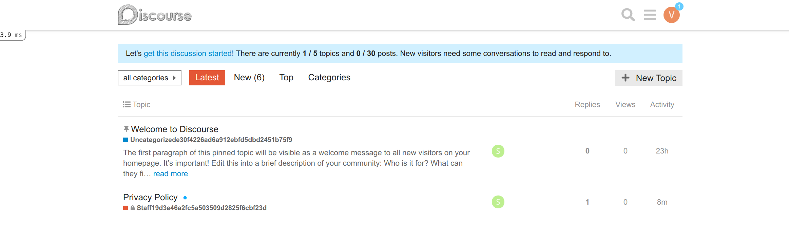

# Discourse Development with Compose

This is set of images for development (not production). I started basing the
recipe on the commands provided [here](https://meta.discourse.org/t/beginners-guide-to-install-discourse-on-ubuntu-for-development/14727), but many of them didn't actually work. I found [this file](https://github.com/discourse/discourse/blob/master/docs/DEVELOPER-ADVANCED.md) to be much more helpful. It's amazing how hard
this is to just get running for development. :(

But, this is mostly working, and is appropriate for someone that doesn't
want to install all those dependencies on their host. First, build the base image:

## Build the container

First, build the container like this. This will clone `DISCOURSE_VERSION`
(see the [Dockerfile](Dockerfile) for this version) into `/usr/src/app`
so that the container will run discourse without any volumes mounted:

```bash
$ docker build -t vanessa/discourse .
```

## Start containers

Export relevant variables to the environment file `.env` (an [example](.env.sample) is provided)
or define directly into the `docker-compose.yml`.

```
    DISCOURSE_HOSTNAME=
    DISCOURSE_SMTP_ADDRESS=
    DISCOURSE_SMTP_PORT=587
    DISCOURSE_SMTP_USER_NAME=
    DISCOURSE_SMTP_PASSWORD=
    DISCOURSE_DEVELOPER_EMAILS=
```

If you are developing locally, the `DISCOURSE_HOSTNAME` should be 0.0.0.0.
The `DISCOURSE_DEVELOPER_EMAIL` should be where you can confirm your account.
Then bring up the containers in detached mode (`-d`)

```bash
$ docker-compose up -d 
```

I'm not super familiar with discourse, but when you bring up the containers,
it will precompile static files for a *long* time and you should wait until 
that finishes

```bash
$ docker-compose logs -f --tail=30 discourse
discourse    | [357] Puma starting in cluster mode...
discourse    | [357] * Version 3.12.1 (ruby 2.6.3-p62), codename: Llamas in Pajamas
discourse    | [357] * Min threads: 8, max threads: 32
discourse    | [357] * Environment: production
discourse    | [357] * Process workers: 4
discourse    | [357] * Preloading application
discourse    | [357] * Listening on tcp://0.0.0.0:3000
discourse    | [357] * Daemonizing...
...
```

I'm not sure I needed to run that command (given running unicorn later) but it seems
to be working, so I'll leave it at that. You can't further interact with the server 
until it finishes that. When it's done, you have one more command to run:

```bash
./start.sh
```

It will first ask you if you want to create an admin account, and you should
(otherwise it will ask for an email confirmation):

```bash
Would you like to make an admin account? y
Email:  myemail@domain.com
Password:  
Repeat password:  

Ensuring account is active!

Account updated successfully!
Do you want to grant Admin privileges to this account? (Y/n)  y

Your account now has Admin privileges!
```

Next time you can skip this. And then it will bring up the server.

```bash
I, [2019-07-10T13:09:45.125739 #377]  INFO -- : listening on addr=0.0.0.0:80 fd=7
I, [2019-07-10T13:09:45.125883 #377]  INFO -- : worker=0 spawning...
I, [2019-07-10T13:09:45.126888 #377]  INFO -- : master process ready
I, [2019-07-10T13:09:45.127158 #382]  INFO -- : worker=0 spawned pid=382
I, [2019-07-10T13:09:45.127340 #382]  INFO -- : Refreshing Gem list
I, [2019-07-10T13:09:50.358572 #382]  INFO -- : worker=0 ready
```

Then open up your browser to [http://localhost/](http://localhost/)
and you can log in with the account you created:



If you didn't create one, it's going to show you the registration page (and it
won't really work to send a verification email:


This took me a few days to figure out, and it would allow for development on a
"production" install. The other option that got working for me on Ubuntu 18.04
were [these set of instructions](https://meta.discourse.org/t/beginners-guide-to-install-discourse-for-development-using-docker/102009/23?u=md-misko). Assuming you have Docker:

```bash
git clone https://github.com/discourse/discourse.git ~/discourse

cd discourse

# start dev
./bin/docker/boot_dev --init
./bin/docker/unicorn

# stop dev
./bin/docker/shutdown_dev
```

## Resources

 - [Redis and Database Environment](https://meta.discourse.org/t/external-database-env-vars-not-documented-external-pg-port-external-redis-env-vars/90879)
